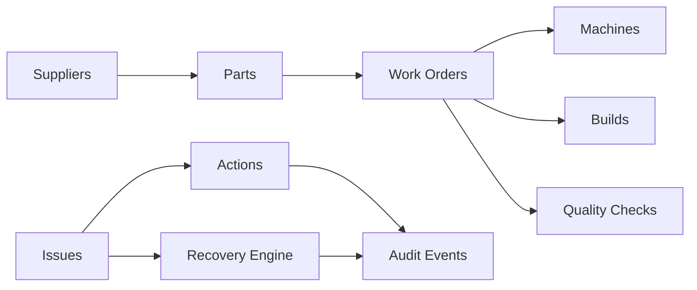

# MicroFactory Command Center

MicroFactory Command Center is a Palantir-inspired operational command center for small manufacturing teams. It connects suppliers, parts, work orders, machines, builds, quality checks, issues, actions, and audit events into one workflow.

## Why this exists

Small hardware teams lose time reconciling fragmented spreadsheets and updates. This project demonstrates grounded impact analysis, human approvals, and auditable action trails.

## Tech stack

- Frontend: Next.js 15, React 19, TypeScript, Tailwind
- Backend: FastAPI, Python 3.12, SQLAlchemy 2.0
- Database: PostgreSQL (Docker Compose)
- Local LLM: Ollama (`qwen2.5:7b-instruct`) with deterministic fallback

## Local setup

```bash
cp .env.example .env
docker compose up -d
```

## Ollama setup

```bash
ollama pull qwen2.5:7b-instruct
ollama serve
```

## Environment variables

See `.env.example`.

## Run backend

```bash
cd backend
uvicorn app.main:app --reload
```

## Run frontend

```bash
cd frontend
pnpm install
pnpm dev
```

## Seed/reset

```bash
curl -X POST http://localhost:8000/api/seed/reset
```

## Demo script

0:00 to 0:20
Small hardware teams do not fail because they cannot design. They fail because execution data is fragmented across inventory sheets, supplier updates, work orders, machine schedules, and quality notes. I built MicroFactory Command Center to turn that fragmented data into an operational command layer.

0:20 to 0:50
The system models the factory as connected objects: suppliers, parts, substitute parts, work orders, machines, builds, and quality checks. This lets the software reason across relationships instead of treating every spreadsheet as isolated.

0:50 to 1:25
Here I trigger a supplier delay. Northline Components is delayed four days on DRV-042. The system immediately traces downstream impact: 7 work orders are blocked, 3 builds are at risk, and the Friday shipment is threatened.

1:25 to 2:00
Now I generate a recovery plan using a local open source model through Ollama. The model does not invent actions. It receives grounded context from the impact engine and returns a structured recovery plan: approve DRV-042B as a substitute, run QA validation, and reschedule WO-018 to CNC-2 tonight.

2:00 to 2:35
Critical changes require human approval. I switch into the Manufacturing Engineer role and approve the substitute action. The system updates the work orders, creates a QA follow up, and records the approval in an append only audit trail.

2:35 to 3:00
This prototype reduces manual impact analysis from around 30 minutes to under 10 seconds. More importantly, it shows how operational software should work: grounded in real objects, close to the user, human approved, and auditable.

## Architecture


